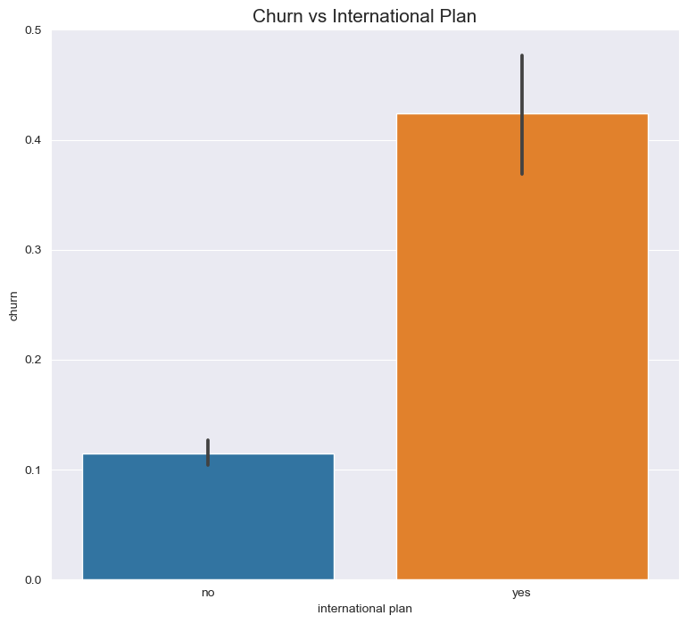

# syriatel-churn-analysis

## Overview
Our client, SyriaTel, is a telecommunication company and is suffering from a loss of valuable customers to competitors.

Understanding customer churn is essential to evaluating the effectiveness of the company’s marketing efforts and the overall satisfaction of the customers. It’s also easier and less expensive to keep existing customers versus to acquire new ones.

Therefore, we are hired to help the management team understand what features are primary determinants of the customer churn. We will further build a classification model to predict whether a customer will (“soon”) stop doing business with SyriaTel.
## Objectives
- Conduct an exploratory data analysis on the existing dataset, which has been obtained from Kaggle.
- Establish a  baseline model using logistic regression.
- Apply machine learning algorithm Decision Tree to build a classifier
- Use the model for classification

## Summary 
### Exploratory Data Analysis
1. Current Churn Rate = 14.5%
2. Churn vs International Plan and Voice Mail Plan

3.Churn vs Customer Service Calls

4. Churn vs Average Monthly Charge

### Baseline model

We built our baseline model following the below process: (1) Set target variable, features (using one-hot encoding on state), and train / test split (2) Instantiate a Logistic Regression (3) Preprocess the model with StandardScaler and SMOTE: (4) Reduce regularization

